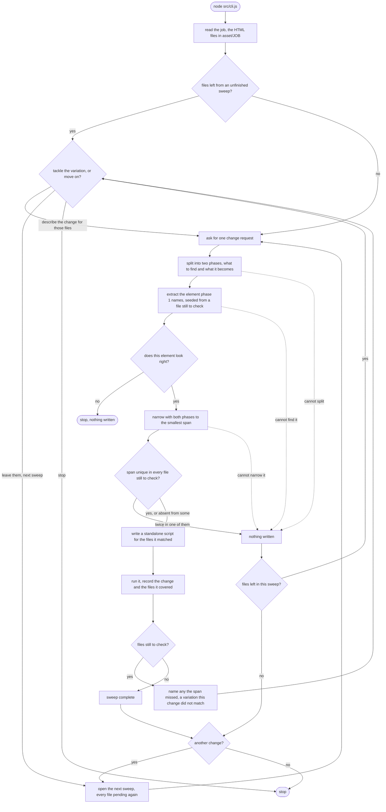

# supersede

Local HTML email change-and-prove toolkit. Put a folder of emails in
`asset/<job>`, describe one change, and the tool narrows it to the smallest
span that is unique across the files, writes a standalone script that applies
it, and records what it covered. `TODO.md` has the build state and the open
decisions.

The flow `src/cli.js` drives, one change per pass:

