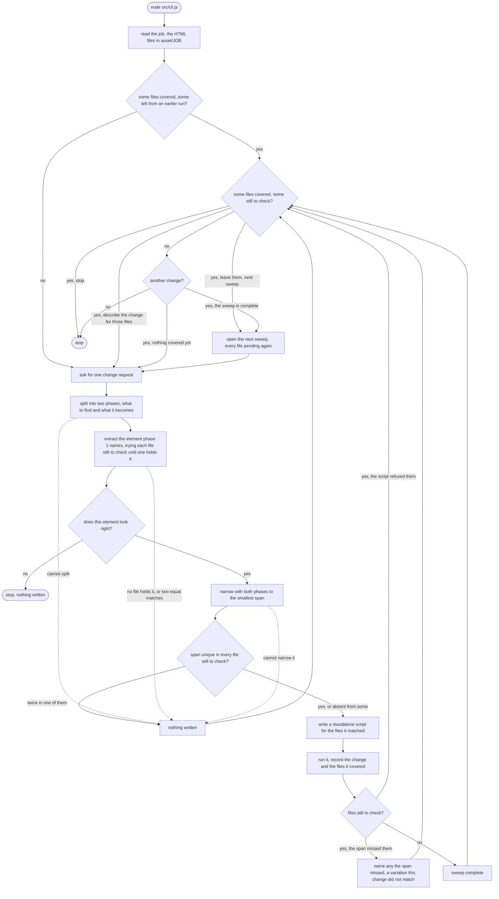

# supersede

Local HTML email change-and-prove toolkit. Put a folder of emails in
`asset/<job>`, describe one change, and the tool narrows it to the smallest
span that is unique across the files, writes a standalone script that applies
it, and records what it covered. `TODO.md` has what is still open.

The flow `src/cli.js` drives, one change per pass:

One element seeds each change. The files still to check are tried in order and
the first one holding the element supplies it, so a variation at the front of
the job no longer sinks the pass; the refusal comes only after the last file.
Only a file that plainly lacks the element is passed over. Anything else — two
equally plausible elements, a malformed answer, a failed call — stops the walk
where it stands, and says which file it stopped at.

