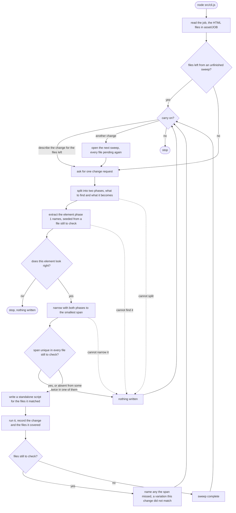

# Interactive flow

The flow `src/cli.js` drives, one change per pass:

The first branch out of `carry on?` is offered only while a sweep has files
left; a complete sweep goes straight to the second.

`src/pipeline/` is those stages in that order. Above it sit the shell files:
`cli.js` entry, `job.js` steps, `html.js` bytes, `luna.js` model.

## Sweeps and variations

A **sweep** is one change goal carried across the job; a **pass** is one trip
through the loop. A pass often finishes a sweep, but not always: the replacement
is deterministic, so a file whose button is built differently holds no match and
stays untouched. Eight of ten emails land; two do not.

That is not a failure and not a complete sweep. The loop applies what matched,
names what it missed, and goes back to `<start>` for a query describing the same
goal for the variation. So a later pass seeds extraction from the first file
still to check, not the job's first file, which by then already carries the new
value — and judges determinism against those files alone.

The sweep closes when every file is updated. Only then does "another change"
open sweep 2, with every file pending again. Declining the files left reaches
that same prompt, so nothing traps the loop. Giving up only reaches
`progress.json` with the next recorded change: give up and quit, and the next
run resumes where it left off.

`progress.json` records `sweep` per change, and only changes that declare one
count towards a sweep's coverage: a job recorded before sweeps existed opens a
fresh sweep over every file instead of inheriting coverage it never earned.

A run that resumes into an unfinished sweep asks before scoping anything to the
files left, so a new goal typed on a later day is not silently applied to two of
ten emails.

A span matching twice inside one file still to check is refused outright, as is
any failure to split, extract or narrow — each returns to the same two prompts
rather than ending the run.

## What this does not prove

Determinism is the only guarantee: one span, unique in every file it writes.
Nothing checks that the result renders correctly, and nothing checks markup
safety — a span inside a `<script>` or `<style>` body is rewritten like any
other. The button run is the case in point: Luna passed a file that OpenCV
caught, and nothing would catch it today.

## Open

- [ ] Run the real Delta job end to end against Luna: two phases, review, narrow,
      script, apply, log.
- [ ] An independent review of the two-phase loop.
- [ ] The human approves the element and never sees the span before the script
      runs. Decide whether `replacementLanded`'s advisory note is enough, or
      whether the review gate belongs after narrowing.
- [ ] A colour change touches several occurrences (`bgcolor`, `background-color`,
      `border`), so one span cannot express it. Narrowing returns `ambiguous`.
      Either return several spans, or widen to one span covering them all.
- [ ] An unfinished sweep asks the human to describe the same goal from scratch.
      The loop knows the request and which files are left; it could carry the
      request forward and ask only what differs in the variation.
- [ ] `leaks` reads a quoted run in the find phase as the value being retired, so
      it stays quiet when a shortening edit names part of the old text.
- [ ] The generated script applies file by file, so a refusal on the third file
      leaves the first two written. Deliberate; revisit if a batch ever needs to
      be all-or-nothing.
- [ ] `decodeHtml` consumes a UTF-8 BOM, so a BOM-led file does not round-trip
      byte-identically.
- [ ] `recordChange` is a read-modify-write of `progress.json`, so two runs on
      one job clobber each other. Sweep state makes the loss costlier.
- [ ] A span that is unique in some files still to check and twice in another is
      refused for all of them, while a span merely absent elsewhere applies to
      what it matched. Both leave a file for a later pass, so the two could be
      treated alike — or the all-or-nothing refusal kept as the stronger signal.
- [ ] `cli.js` sorts expected refusals from bugs with a `fatal` predicate on the
      error type. A tagged error class thrown by the pipeline would say it at the
      source instead.
